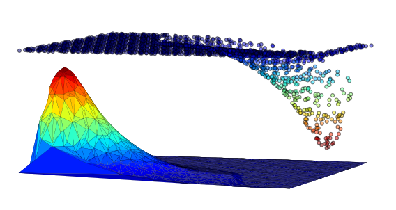

# omm_jrsi

### Welcome to our omm_jrsi project !

### What is this?

You will find here the data and codes corresponding to our submission to the
Journal of the Royal Society Interface. The repository is organized as follows:

    * Codes
        * ./omm: 
        * ./time_step_selection
    * Data
        * ./test_case_1:
        * ./test_case_2:
        * ./test_case_3:
        * ./test_case_4:      
